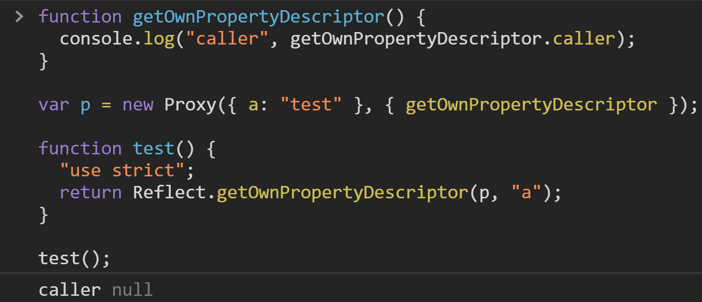
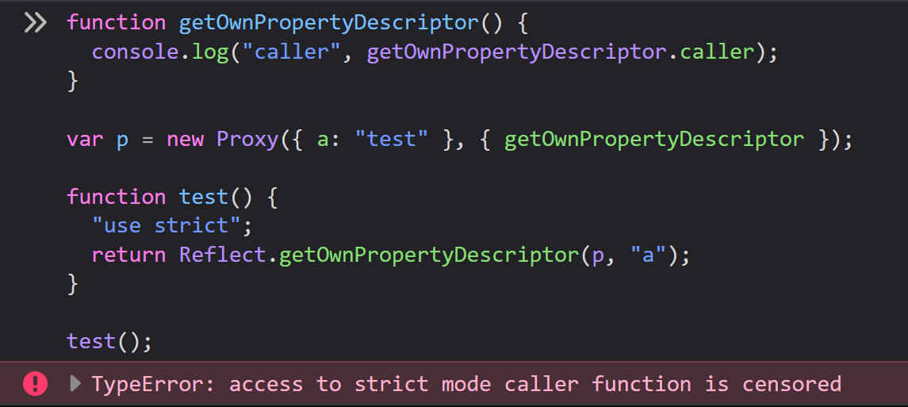
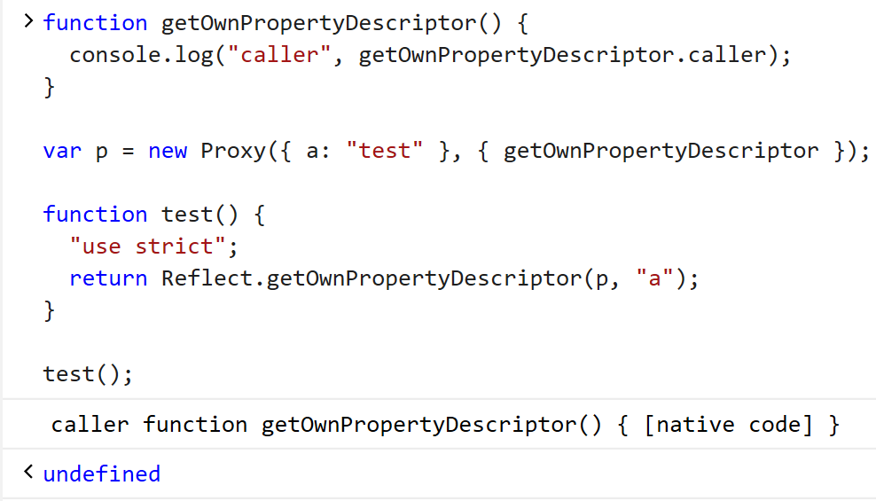

# Proposal: Strict built-in functions

**Champions**: [Mark S. Miller](https://github.com/erights)

**Author**: [Jack Works](https://github.com/Jack-Works), [@mnis1000](https://github.com/mnis1000) and Mark S. Miller

**Stage**: N/A

## Motivation

This code is evaluated differently in Chrome, Firefox and Edge.

```js
function getOwnPropertyDescriptor() {
  console.log("caller", getOwnPropertyDescriptor.caller);
}

var p = new Proxy({ a: "test" }, { getOwnPropertyDescriptor });

function test() {
  "use strict";
  return Reflect.getOwnPropertyDescriptor(p, "a");
}

test();
```

<details>
<summary>Evaluation result</summary>

Chrome: <br />
Firefox: <br />
Edge: <br />

</details>

At first, I though it is a "undefined behavior" so I looked up the spec. It turns out that both Chrome, Firefox and Edge are not violating the spec.

## Spec

In the spec [16.2 Forbidden Extensions](https://tc39.es/ecma262/#sec-forbidden-extensions), it writes

> If an implementation extends any function object with an own property named "caller" the value of that property, as observed using `[[Get]]` or `[[GetOwnProperty]]`, must not be a strict function object. If it is an accessor property, the function that is the value of the property's `[[Get]]` attribute must never return a strict function when called.

Edge returns the native `Reflect.getOwnPropertyDescriptor` function. It must be a non-strict function.

In the spec [9.3 Built-in function Objects](https://tc39.es/ecma262/#sec-built-in-function-objects) it writes

> Built-in functions that are _ECMAScript function objects_ must be strict functions.

There is no rule to restrict if a built-in function should be implemented as ECMAScript function or native code. Therefore the "strictness" of the built-in function is unstable between implementations.

## Proposal

Change the spec of [9.3 Built-in function Objects](https://tc39.es/ecma262/#sec-built-in-function-objects):

All built-in function objects must be strict functions.

```diff
- Built-in functions that are ECMAScript function objects must be strict functions.
+  Built-in function objects must be strict functions.
```
